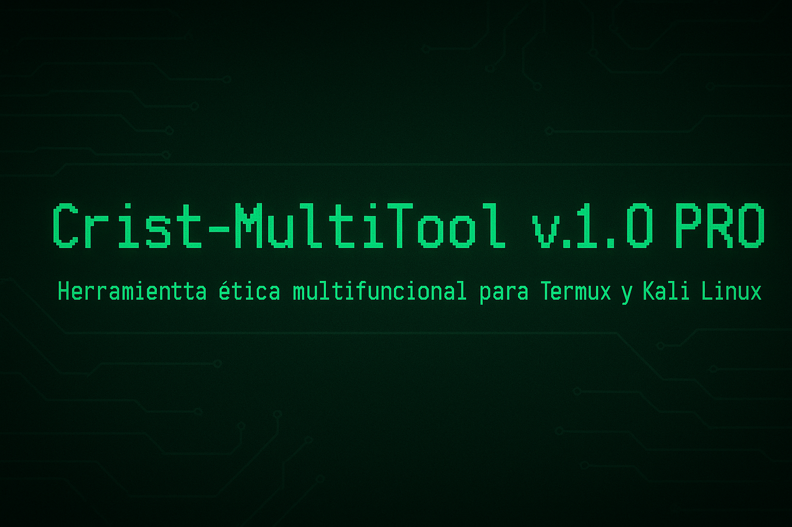

# 🧠 Crist-MultiTool v1.0 PRO

Herramienta multifuncional para Termux y Kali Linux, diseñada por Crist Hack. Ejecuta tareas de red, descargas, diagnóstico y más, todo desde una interfaz hacker visual y profesional.

---

## 🚀 Características

✅ Compatibilidad total con Termux y Kali  
✅ Ejecuta comandos en Python + Bash de forma ultra rápida  
✅ Diseño visual tipo terminal hacker con banner incluido  
✅ Cada función separada y explicada por claridad  
✅ Código abierto, optimizado y funcional

---

## 📦 Instalación desde GitHub

```bash
git clone https://github.com/hackcrist/MultiTool-Crist.git
cd Crist-MultiTool
bash install.sh
```

---

## 🛠️ Requisitos

```bash
pkg update -y && pkg install git python figlet lolcat -y
pip install colorama pyfiglet
```

---

## 🧪 Comandos disponibles

```bash
1️⃣   Escanear red local  
    🔍 Usa nmap para detectar dispositivos conectados  

2️⃣   Ver IP local y pública  
    🌐 Muestra tu IP interna y externa con curl e ip  

3️⃣   Descargar videos  
    📥 Usa yt-dlp para descargar contenido multimedia  

4️⃣   Modo diagnóstico total  
    🤖 Ejecuta escaneo + IP + prueba de red automáticamente  

5️⃣   Salir  
    ❌ Cierra la herramienta con limpieza
```

---

## 🎨 Estilo visual

- Banner estilo hacker con `figlet + lolcat`  
- Menú con colores y separación clara  
- Estructura modular para agregar más herramientas fácilmente

---

## ❤️ Apoya el proyecto

⭐ Si te gusta este repositorio, deja una estrella en GitHub  
💸 Donación opcional: **miniosjuan89@gmail.com** (PayPal)

---

By Crist Hack – Solo para uso ético  
Licencia Apache 2.0
